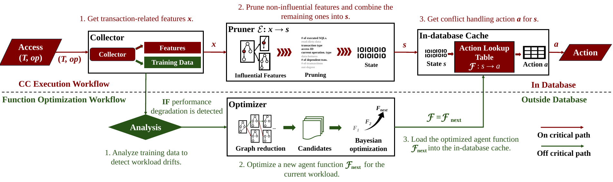

# CCaaLF: Concurrency Control as a Learnable Function

---

This repository contains the code for the paper "CCaaLF: Concurrency Control as a Learnable Function".



## CCaaLF Overview

Concurrency control (CC) algorithms are important in modern transactional databases, as they enable high performance by executing transactions concurrently while ensuring correctness. However, state-of-the-art CC algorithms struggle to perform well across diverse workloads, and most do not consider workload drifts.


In our paper, we propose **CCaaLF (Concurrency Control as a Learnable Function)**, a novel learned concurrency control algorithm designed to achieve high performance across varying workloads. The algorithm is quick to optimize, making it robust against dynamic workloads. CCaaLF learns an agent function that captures a large number of design choices from existing CC algorithms. The function is implemented as an efficient in-database lookup table that maps database states to concurrency control actions. The learning process is based on a combination of Bayesian optimization and a novel graph reduction algorithm, which converges quickly to a function that achieves high transaction throughput. We compare CCaaLF against five state-of-the-art CC algorithms and show that our algorithm consistently outperforms them in terms of transaction throughput and optimization time.

## Implementation

### Project Overview
This repository contains all the code used for the experiments presented in our paper (`MAIN_DIR`):

- **`ycsb`**: For experiments in the YCSB stored procedure mode.
- **`tpcc`**: For experiments in the TPCC stored procedure mode.
- **`tpce`**: For experiments in the TPCE stored procedure mode.
- **`ycsb-interactive`**: For experiments in the YCSB interactive mode.
- **`tpcc-interactive`**: For experiments in the TPCC interactive mode.


### Critical Components

Our implementation of **CCaaLF**'s critical components can be found in the following files:

- **`learn.h/cc`**: our feature collector and pruner module that captures transaction-related features and refines them for use in the optimization process.
- **`policy.h/cc`**: our in-database cache that supports the loading and storage the optimized agent functions.
- **`training/cc_optimizer.py`**: our concurrency control algorithm optimizer.
- **`encoder/*`**: the optimized feature pruning strategies.

### Environment

Clone the repository, navigate to the `MAIN_DIR`, and build the environment using the provided Dockerfile:
```shell
docker build -t test-CCaaLF .
```

Run the Docker container and enter the shell:
```shell
docker run -dt --name test_cc test-CCaaLF bash
docker exec -it test_cc bash
```

### Running Experiments

Inside the Docker container, build the project:
```shell
make dbtest -j
```

To run experiments:
```shell
python run_exp.py
```

The resulting experimental data traces can be found in `MAIN_DIR/training/bo-all/*`.

## Acknowledgements

---

This project is based on the following open-source projects: [Silo](https://github.com/stephentu/silo), [PolyJuice](https://github.com/derFischer/Polyjuice). We thank their authors for making the source code publicly available. The `ycsb-interactive` and `tpcc-interactive` are implemented from the 2PL variant, the `ycsb`, `tpcc`, and `tpce` are implemented from the IC3 variant. In both two types, we have adopt their implementation of data management, transaction processing framework, and TPCC/TPCE workload generator.
